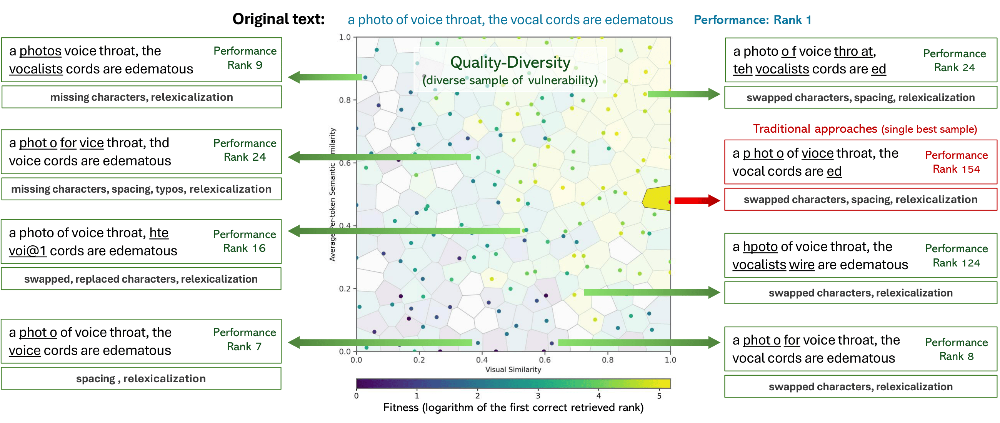

# Adversarial Prompt Illumination for Vision-Language Models

> Official implementation of **"Investigating Robustness in Vision-Language Models via Adversarial Prompt Illumination"**  
> Accepted as a full paper at **GECCO 2026** · San Jose, Costa Rica



---

## Setup

**1. Install [uv](https://docs.astral.sh/uv/getting-started/installation/)**
```bash
pip install uv
```

**2. Install dependencies**
```bash
uv sync
```

**3. Download datasets and model checkpoint**

Datasets:
```bash
gdown 1BpyFjK1dJv0NCXdmYtuf4C6ZQo2MT4Uw
unzip datasets.zip
```

Model checkpoint (ENTRepCLIP):
```bash
gdown 1W0qqLmv906mxFF5qqYIF-iD6cjB1JyTG
unzip models.zip
```

---

## Experiments

### Attack VLMs with CVT-MAP-Elites

```bash
uv run main.py run_name=<run_name> env.dataset_model=<dataset_model>
```

**Example:**
```bash
uv run main.py run_name=logs/qd/entrep/ env.dataset_model=entrep
```

**Available `env.dataset_model` options:**

| Value | Dataset | Model | Setting |
|---|---|---|---|
| `mscoco_b32` | MS COCO | CLIP ViT-B/32 | Exact match |
| `mscoco_l14` | MS COCO | CLIP ViT-L/14 | Exact match |
| `entrep` | ENTRep | ENTRepCLIP | Exact match |
| `entrep_class` | ENTRep | ENTRepCLIP | Class match |
| `mimic` | MIMIC | BioMedCLIP | Exact match |
| `mimic_class` | MIMIC | BioMedCLIP | Class match |

To reproduce the full VLM experiment:
```bash
bash experiments/1_vlm.sh
```

---

### Attack with Standard GA

```bash
uv run main.py run_name=<run_name> env.dataset_model=<dataset_model> qd.qd_name=cvtga qd.thres=<threshold>
```

**Example:**
```bash
uv run main.py run_name=logs/ga-0.5/entrep_class/ env.dataset_model=entrep_class qd.qd_name=cvtga qd.thres=0.5
```

To reproduce the GA experiment with different thresholds:
```bash
bash experiments/2_method.sh
```

---

### Transfer Attack

After running an attack on a source model, transfer adversarial examples to a different model within the same dataset:

```bash
uv run main.py \
  run_name=<target_run_name> \
  env.dataset_model=<target_dataset_model> \
  source_dir=<source_run_name>
```

**Example:**
```bash
uv run main.py \
  run_name=logs/transfer/mscoco_b32/ \
  source_dir=logs/qd/mscoco_l14/ \
  env.dataset_model=mscoco_b32
```

To reproduce the MS COCO transfer experiment:
```bash
bash experiments/3_transfer.sh
```

---

### 3D Archive

Run CVT-MAP-Elites with a 3D behavioral descriptor archive:

```bash
uv run main.py run_name=<run_name> env.dataset_model=<dataset_model> env.dim=3 qd.centroids_folder=<centroid_folder>
```

**Example:**
```bash
uv run main.py run_name=logs/3d/entrep_class/ env.dataset_model=entrep_class env.dim=3 qd.centroids_folder=3d_centroids
```

> **Note:** Pre-computed centroids for 2D and 3D archives are provided in `2d_centroids/` and `3d_centroids/` for reproducibility. To generate new centroids, point `qd.centroids_folder` to a new path.

To reproduce the 3D archive experiment:
```bash
bash experiments/4_3d_archive.sh
```

---

### Ablation Study

```bash
bash experiments/ablation.sh
```

For a full list of hyperparameters, see [`openelm/configs.py`](openelm/configs.py).

---

## Acknowledgements

This codebase builds on:

- **[RIATIG](https://github.com/WUSTL-CSPL/RIATIG)** by Han Liu, Yuhao Wu, Shixuan Zhai, Bo Yuan, and Ning Zhang (`attack_utils.py`)
- **[OpenELM](https://github.com/CarperAI/OpenELM.git)** by CarperAI (main framework)
- **[Vision-language-Models-in-Medical-Image-Analysis](https://github.com/Ly-Lynn/Vision-language-Models-in-Medical-Image-Analysis)** by KhoaTN and Lynn Ly (configs and modules)

---

## Citation

```bibtex
@inproceedings{NguyenTranPhanLuongGECCO2026,
  author    = {Thai Huy Nguyen, Khoa Tran, Quan Minh Phan, and Ngoc Hoang Luong},
  title     = {{Investigating Robustness in Vision-Language Models via Adversarial Prompt Illumination}},
  booktitle = {GECCO '26: Proceedings of the Genetic and Evolutionary Computation Conference},
  address   = {San Jose, Costa Rica},
  publisher = {{ACM}},
  year      = {2026}
}
```